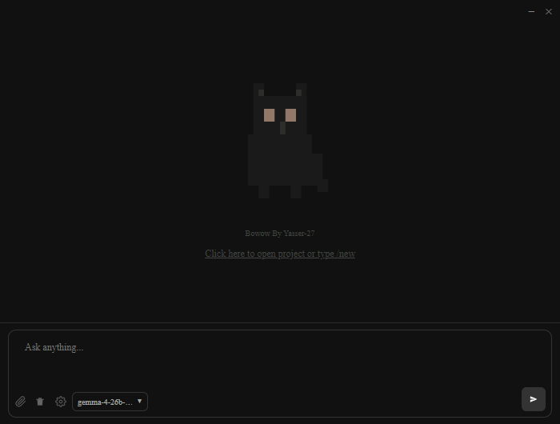

<p align="center">
  
  <h1 align="center">Bowow (BETA) </h1>
<p align="center">The open source AI coding agent.</p>
<p align="center">
  
</p>

<p align="center">
<a href="README.md">English</a> |
<a href="README.ar.md">العربية</a> 
</p>

>Usage

>1. Launch the app and open the Settings panel to configure your AI provider and API key, and click done.
>2. Connect to a model (Gemini, OpenAI, Ollama, etc.).
>3. Open a project folder or start a new session.
>4. Describe what you want to build — the agent will generate files, edit code, and run commands.
>5. Use F10 to toggle split-screen mode for multi-session management.
>6. For close split-screen Use F10 not (X)

##  split-screen mode (F10)

<p align="center">
  
</p>

#### Bowow sample and esay

## Features

- **Multi-Model Support** — Works with Gemini, OpenAI, OpenRouter, Ollama, and llama.cpp backends.
- **Split-Screen Mode** — Toggle a 4-pane view (F10) to manage multiple build sessions simultaneously.
- **Live File Editing** — The agent reads, writes, and diffs project files directly on disk.
- **Checkpoint System** — Undo file changes with checkpoint-based rollback.
- **Context Management** — Automatic conversation compaction and pruning to stay within model context limits.
- **Error Auto-Retry** — Detects transient errors and retries with exponential backoff.
- **Responsive UI** — Adaptive font sizing and layout across window sizes.
- **Session Persistence** — All builds, conversations, and files survive app restarts via file-based storage.

---

### Installation
```bash
git clone https://github.com/YASSER-27/Bowow.git
or
irm https://raw.githubusercontent.com/YASSER-27/Bowow/main/scripts/install.ps1 | iex
```

```bash
npm install
npm run dev
```

### Production Build

```bash
# Windows
npm run build:win

# macOS
npm run build:mac

# Linux
npm run build:linux
```

### Desktop App (BETA)

**Bowow** is a desktop application
- **build** - full-access agent for development work

## Keyboard Shortcuts

| Key | Action |
|---|---|
| F10 | Toggle split-screen / fullscreen |
| F12 | Toggle DevTools |
| Esc | Close Settings modal |

## License

MIT

BOWOW BY [YASSER-27](https://github.com/YASSER-27)

<p align="center">
  
</p>
