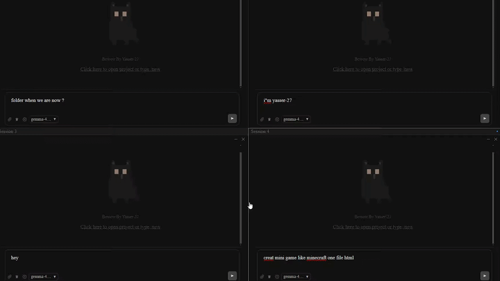

<p align="center">
  <a href="https://github.com/YASSER-27/Bowow/releases/latest">
    
  </a>
</p>

<h1 align="center">Bowow - BETA</h1>

<p align="center">
  The open source AI coding agent.

<p align="center">
<a href="README.md">English</a> | 
<a href="README.ar.md">العربية</a> 

<p align="center">
    <a href="https://github.com/YASSER-27/Bowow/blob/main/LICENSE">
        
    </a>
    
    
    

<p align="center">
  <a href="https://github.com/YASSER-27/Bowow/releases/latest">
    
  </a>
</p>

#### Usage

-  Launch the app and open the Settings panel to configure your AI provider and API key, click done.
-  Connect to a model (Gemini, OpenAI, Ollama, etc.).
-  Open a project folder ( /new )
-  Describe what you want to build — the agent will generate files, edit code, and run commands.
-  Use F10 to toggle split-screen mode for multi-session management.

> This is version 1.0.0; the new version 1.5.0 is better than this

<p align="center">
  
</p>

### Updates & Improvements 

- Performance Optimization: Resolved performance lags; the application is now stable. Please report any issues on our Issues page.
- New Settings Window: Introduced a dedicated Settings window with a significantly improved and cleaner user interface.
- RTL Language Support: Fixed Arabic text rendering issues; text now correctly aligns to the right, including in input fields.
- Refined UI: Removed the border from AI messages, keeping only the user message borders for a cleaner, modern, and elegant look.
- Easter Egg: Head over to Settings and click on the "Bowow" name to see a little surprise!
- Persistence: Chat sessions are now persistent. Your conversations are saved automatically and will not be lost when closing the app until you manually delete them.


## Features

- **Multi-Model Support** — Works with Gemini, OpenAI, OpenRouter, Ollama, and llama.cpp backends.
- **Split-Screen Mode** — Toggle a 4-pane view (F10) to manage multiple build sessions simultaneously.
- **Live File Editing** — The agent reads, writes, and diffs project files directly on disk.
- **Checkpoint System** — Undo file changes with checkpoint-based rollback.
- **Context Management** — Automatic conversation compaction and pruning to stay within model context limits.
- **Error Auto-Retry** — Detects transient errors and retries with exponential backoff.
- **Responsive UI** — Adaptive font sizing and layout across window sizes.
- **Session Persistence** — All builds, conversations, and files survive app restarts via file-based storage.
- **MCP Tools** — MCP Tools: Integration of MCP Tools is now available (Experimental).
- **System Prompt** — System Prompt: Configure a custom system prompt to define the AI's behavior and persona.
- **User Prompts** — User Prompts: Added the ability to create, save, and manage multiple user prompts simultaneously for better workflow management.
- **Terminal Commands** — Terminal Commands: Enhanced terminal control; you can now enforce specific commands or restrictions for the AI to follow.
- **Updates** — Auto-Update System: Stay up-to-date effortlessly. You can now check for and install the latest versions directly from the new Settings menu.

---

### Installation
```bash
git clone https://github.com/YASSER-27/Bowow.git

irm https://raw.githubusercontent.com/YASSER-27/Bowow/main/scripts/install.ps1 | iex
```

```bash
npm install
npm run dev
```

### Production Build

```bash
# Windows
npm run build:win

# macOS
npm run build:mac

# Linux
npm run build:linux
```

### Desktop App (BETA)

**Bowow** is a desktop application
- **build** - full-access agent for development work

## Keyboard Shortcuts

| Key | Action |
|---|---|
| F10 | Toggle split-screen / fullscreen |
| F12 | Toggle DevTools |
| Esc | Close Settings modal |


BOWOW BY [YASSER-27](https://github.com/YASSER-27)

<p align="center">
  
</p>
